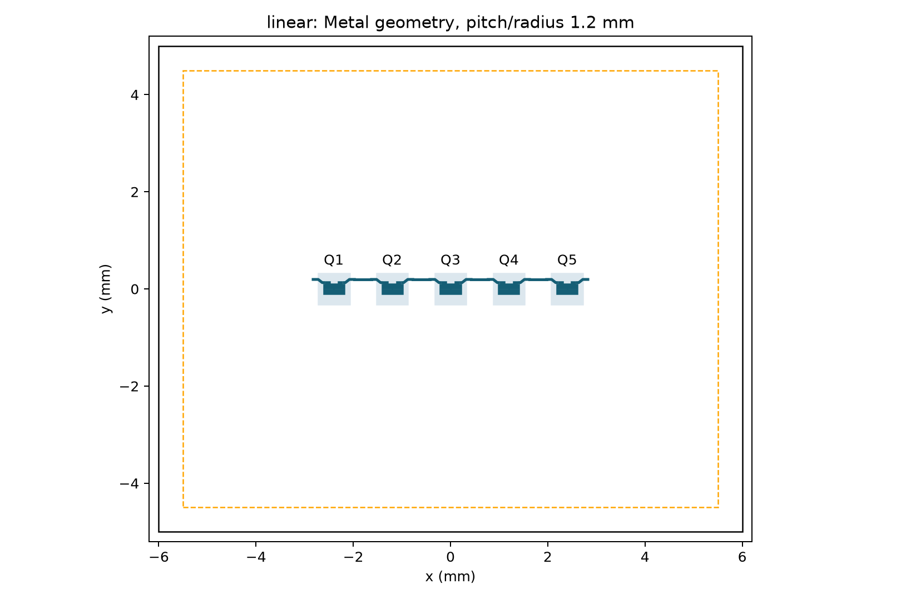
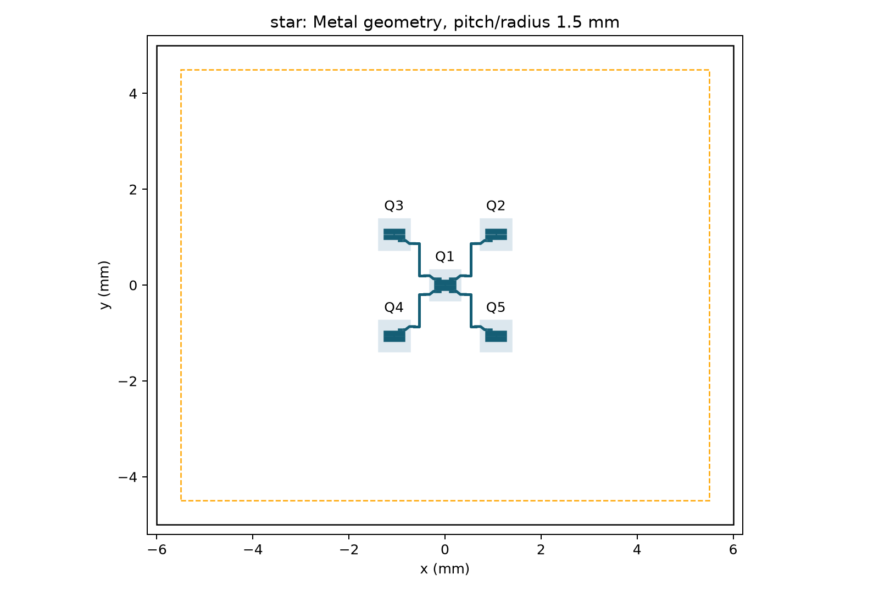
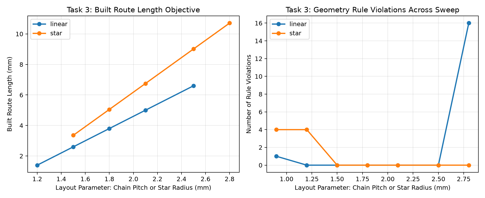

# Optimizing a 5-Qubit Superconducting Quantum Chip (Qiskit Metal)
**Alexandria Quantum Hackathon 2026 (AQH26) Parachute 🪂 Team — Track 4: Quantum Hardware Design Workflow**


We compare **linear chain (1D nearest-neighbor)** and **star (central hub)** topologies for a 5-qubit superconducting transmon processor designed in **Qiskit Metal**. Both candidate architectures are designed and geometrically analyzed on a standardized **12 mm × 10 mm** high-resistivity silicon substrate. 

We systematically sweep physical qubit placement, construct and measure actual Coplanar Waveguide (CPW) routes, enforce automated geometric Design Rule Checks (DRC), and benchmark the optimized candidates against algorithmic quantum workloads (5-qubit GHZ state preparation and 1D Trotterized nearest-neighbor circuits).

---

## Final Layout Candidates

| Linear Chain (Pitch = 1.2 mm) | Star Topology (Radius = 1.5 mm) |
| :---: | :---: |
|  |  |
| *Shortest total routing (1.400 mm), minimal crosstalk risk* | *Centralized routing (3.356 mm), star hub connectivity* |

---

## Measured Engineering Comparison

The table below summarizes the quantitative results extracted directly from built Qiskit Metal geometry (`results/metal_comparison.csv`):

| Metric | Linear Chain | Star Hub | Delta / Engineering Note |
| :--- | :---: | :---: | :--- |
| **Optimal Parameter** | **1.2 mm** (pitch) | **1.5 mm** (radius) | Minimum spacing satisfying physical DRC |
| **Total Built CPW Routing Length** | **1.400 mm** | **3.356 mm** | Linear chain saves **58.3%** total conductor length |
| **Longest Individual Route ($L_{\max}$)** | **0.350 mm** | **0.839 mm** | Chain weakest link is **58.3%** shorter |
| **Detected Route Crossings** | **0** | **0** | Both layouts are fully planar (0 airbridges needed) |
| **Physical DRC Violations** | **0 (PASS)** | **0 (PASS)** | Both layouts pass edge margin, pocket gap & trace rules |
| **Min. Route Clearance** | **0.828 mm** | **0.368 mm** | Chain provides **>2.2×** larger clearance margin |
| **Graph Diameter / Max Degree** | Diam: 4 / Deg: 2 | Diam: 2 / Deg: 4 | Star has low diameter; Chain has uniform low degree |
| **Target Workload Advantage** | 1D Trotter, QAOA | Centralized GHZ | Chain eliminates hub routing congestion & frequency crowding |
| **Fabrication & Yield Risk** | **Lowest** | Moderate | Chain minimizes capacitive loading & parasitic coupling |

---

## Key Findings & Engineering Trade-offs

1. **Routing Length & Dielectric Loss:**  
   The linear chain achieves a total routing length of **1.400 mm** with a maximum individual coupler length of **0.350 mm**. By contrast, the star topology requires **3.356 mm** total routing and **0.839 mm** for each hub-to-leaf coupler. Because surface dielectric and conductor losses scale with physical route length, the chain architecture offers a lower loss footprint for equivalent substrate quality.
2. **Clearance & Crosstalk Immunity:**  
   The linear chain maintains a minimum clearance of **0.828 mm** between route envelopes, compared to **0.368 mm** in the star layout. The 4-port central transmon in the star concentrates capacitive coupling and increases the risk of parasitic cross-talk and frequency collisions.
3. **Workload Suitability:**
   - **Linear Chain:** Ideal for 1D quantum chemistry simulations, 1D Heisenberg/Ising spin chains, and QAOA on line graphs where interactions are exclusively nearest-neighbor.
   - **Star Topology:** Offers graph diameter 2 for hub-mediated algorithms. However, **a star does not automatically prepare GHZ states in less circuit depth**: because the central transmon cannot participate in multiple two-qubit operations simultaneously, two-qubit gates sharing the hub must be serialized.
4. **Final Recommendation:**  
   For experimental demonstration and near-term fabrication, **we recommend the Linear Chain architecture**. It achieves zero crossings, minimizes total metal exposure, avoids central transmon congestion, and maximizes routing clearance margins.

---

## Design Rules & Manufacturability Checks (DRC)

All candidate layouts are subject to baseline physical design rules implemented in Python:

* **Chip Footprint:** 12.0 mm × 10.0 mm substrate die.
* **Keep-Out Margin:** All qubit components and CPW traces must remain $\ge 0.50\text{ mm}$ (nominal $1.0\text{ mm}$) inside the chip edge.
* **Qubit Pocket Spacing:** Ground-plane pocket cutout gap between adjacent transmons $\ge 0.30\text{ mm}$ to prevent capacitive shorting and spurious pocket overlap.
* **CPW Transmission Line Geometry:** Nominal trace width $w = 10\ \mu\text{m}$, gap $g = 6\ \mu\text{m}$ (absolute minimum $w \ge 8\ \mu\text{m}$, $g \ge 4\ \mu\text{m}$) targeting nominal $Z_0 \approx 50\ \Omega$ on high-resistivity silicon ($\varepsilon_r \approx 11.45$).
* **Route Envelope Clearance:** Spacing between unrounded buffered CPW traces and adjacent structures $\ge 0.15\text{ mm}$.
* **Planarity / Crossing Check:** Line intersections are strictly checked; 0 crossings required for single-layer planar fabrication without airbridges.

---

## Optimization & Parameter Sweeps

We swept the layout parameter across 7 candidate spacings ($0.9\text{ to }2.8\text{ mm}$) for each topology:
- **Linear Chain:** Nearest-neighbor qubit pitch ($x$-spacing).
- **Star Hub:** Center-to-leaf radial distance.



* **Linear Chain Feasibility:** At $0.9\text{ mm}$ pitch, transmon ground pockets collide, triggering DRC rejection. Feasibility begins at $1.2\text{ mm}$, which minimizes route length ($1.400\text{ mm}$). Larger spacings monotonically increase route length without added benefit.
* **Star Feasibility:** Radii below $1.5\text{ mm}$ cause pocket crowding around the 4-port central transmon. Feasibility begins at $1.5\text{ mm}$ ($3.356\text{ mm}$ total route length).

---

## Project Structure

```
.
├── README.md                      # Engineering overview, results, and reproduction guide
├── requirements.txt               # Pinned Python package dependencies
├── run_all.py                     # Primary runner: builds Metal chips, runs DRC & exports artifacts
├── run_proxy.py                   # Fast screening exploration (chain, star, ring)
├── src/
│   ├── baseline_chip.py           # Task 1: Standardized 12x10mm substrate & baseline geometry
│   ├── design_rules.py            # Task 1: Centralized 8-rule physical DRC thresholds
│   ├── chain_topology.py          # Task 2: Qiskit Metal 5-qubit linear chain builder
│   ├── star_topology.py           # Task 2: Qiskit Metal 5-qubit star hub builder
│   ├── metal_analysis.py          # Tasks 2 & 5: Shapely geometry analysis, clearance & DRC checks
│   ├── drc_check.py               # Task 1: Bounding-box and gap evaluation utilities
│   ├── em_routing_analysis.py     # Task 4: Crossings, airbridges, envelope clearance & lambda/4 analysis
│   ├── drc_summary.py             # Task 5: 6-rule pass/fail evaluation matrix
│   ├── task6_synthesis.py         # Task 6: Comparative synthesis table & balanced recommendation
│   ├── submission_report.py       # Formal 4-page report generator (PDF & Markdown)
│   ├── topologies.py              # Graph topology algorithms (degree, diameter, shortest paths)
│   ├── geometry_metrics.py        # Segment distance and crossing geometry helpers
│   ├── optimizer.py               # Screening parameter sweep and ranking
│   └── plotting.py                # Visual layout rendering and sweep curve plotting
├── scripts/
│   └── task3_refined_optimizer.py # Continuous binary-search boundary optimizer
├── designs/
│   ├── linear.py                  # Standalone reconstruction script for optimal linear chain
│   └── star.py                    # Standalone reconstruction script for optimal star hub
├── figures/                       # Rendered layouts, parameter sweep plots, and heatmaps
│   ├── metal_linear.png           # Render of optimal linear chain (1.2 mm pitch)
│   ├── metal_star.png             # Render of optimal star hub (1.5 mm radius)
│   └── metal_sweep.png            # 7-point parameter sweep and DRC feasibility curves
├── reports/
│   ├── technical_report.pdf       # 4-page submission technical report
│   ├── technical_report.md        # Technical report markdown source
│   ├── task6_recommendation.md    # Task 6: Synthesis and balanced recommendation report
│   └── judges_QA.md               # Detailed technical Q&A for competition defense
├── results/
│   ├── metal_sweep.csv            # Task 3: 7-point sweep for both topologies with DRC & cost
│   ├── metal_comparison.csv       # Task 3: Head-to-head comparison of optimal candidates
│   ├── task3_refined_best.csv     # Task 3: Continuous refined optimizer results
│   ├── em_routing_summary.csv     # Task 4: EM-aware routing metrics & lambda/4 analysis
│   ├── drc_summary.csv            # Task 5: Comprehensive 6-rule DRC pass/fail status
│   ├── drc_iteration_failures.csv # Task 5: Documented failure modes and engineering resolutions
│   ├── task6_synthesis.csv        # Task 6: Final synthesis across physical, EM & graph metrics
│   └── environment.json           # Execution runtime and package environment stamp
└── tests/
    ├── test_integration.py       # Automated regression tests (optimizer, DRC, crossings)
    └── test_task6.py             # Dedicated Task 6 synthesis & graph metric tests
```

---

## Reproducing the Results

The workflow runs entirely in headless mode and requires Python **3.11** or **3.12**.

### 1. Setup Virtual Environment

```bash
# Clone the repository
git clone https://github.com/Siwarx3/quantum-hackathon-2026-parachute.git
cd quantum-hackathon-2026-parachute

# Create and activate virtual environment
python3.12 -m venv .venv
source .venv/bin/activate

# Install dependencies
pip install -r requirements.txt
pip check
```

### 2. Execute Physical Workflow & Generate Deliverables

```bash
# Runs full physical sweep, DRC checks, layout rendering, and generates the technical report
python run_all.py
```

Outputs will be populated in `results/`, `figures/`, and `reports/technical_report.pdf`.

### 3. Run Automated Tests

```bash
python -m unittest discover -s tests
```

### 4. Fast Screening Workflow (Optional)

```bash
python run_proxy.py
```

*Note: `run_proxy.py` performs fast graph-level screening (including a 5-qubit ring). Physical submission claims and deliverables are strictly grounded in the built Qiskit Metal designs generated by `run_all.py`.*

---

## Design Iteration Record

Hardware design is inherently an iterative process. Our key design iterations include:

1. **Pin Orientation Fix (Chain):** Initial pin assignments placed connection pads facing away from neighbors, causing `RoutePathfinder` to route circuitous loops and trigger bend-radius fillet warnings. Pins were re-engineered to face adjacent transmons with $100\ \mu\text{m}$ lead-ins, cutting route lengths by over $60\%$.
2. **Substrate Standardization:** Standardized both topologies onto an identical $12\text{ mm} \times 10\text{ mm}$ planar substrate to ensure strict comparability.
3. **Accurate Length Extraction:** Replaced naive target length requests (`options.total_length`) with extracted Metal route lengths (`route.length`) to accurately incorporate corner fillets and lead offsets.
4. **Hard DRC Filtering:** Upgraded optimization selection from soft penalties to strict hard constraint filtering, ensuring infeasible layouts cannot be selected.
5. **Full Die Boundary Checking:** Expanded edge keep-out checks from transmon pocket centers to the bounding envelopes of all metal components and routed traces.
6. **Pairwise Route Clearance:** Implemented pairwise clearance evaluation across all unrounded buffered CPW traces to guarantee no hidden trace-trace or trace-pocket collisions.

---

## Alignment with Sustainable Development Goals (SDG)

* **SDG 9: Industry, Innovation, and Infrastructure:** Advances automated, reproducible workflows for superconducting quantum circuit design, reducing design iteration cycles and cleanroom fabrication waste.
* **SDG 4: Quality Education:** Provides an open, fully documented, and testable end-to-end design methodology for students and researchers in quantum hardware engineering.

---

## Author & Acknowledgements

* **Siwar Diab**
* **Lubna Ibrahim**
* **Ahmed Ashraf**
* **Mentor:** Julián Stiefkens
